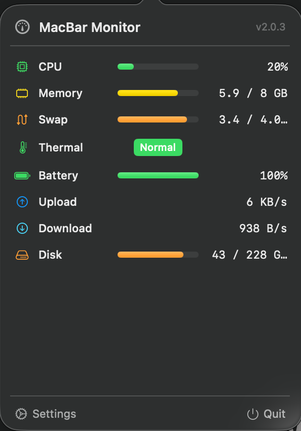
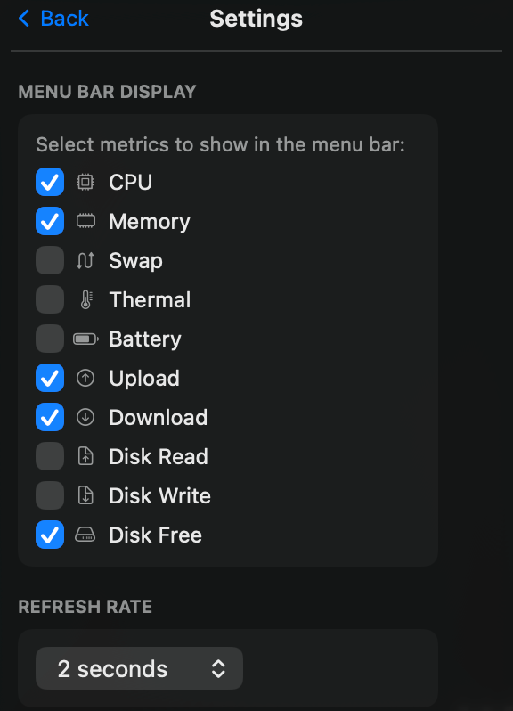

# MacBar Monitor

A lightweight macOS menu bar system monitor that displays real-time system metrics directly in your menu bar.

## Screenshots

### Menu Bar


### Popover Dashboard


### Settings


---

## Fitur

- **CPU Usage**: Real-time CPU utilization percentage
- **Memory Usage**: RAM usage with used/total bytes
- **Swap Usage**: Swap memory utilization
- **Thermal State**: System thermal condition (Normal/Elevated/Hot/Critical)
- **Battery Status**: Charge percentage and charging indicator
- **Network Activity**: Upload and download speeds (bytes/sec), local counters only
- **Disk Space**: Free disk capacity

## Persyaratan

- **macOS 14.0** (Sonoma) atau lebih baru
- **Swift 5.9** atau lebih baru
- Tanpa dependency eksternal

## Instalasi

### Build dari Source

```bash
git clone <repository-url>
cd n-stats

# Build proyek
swift build

# Jalankan aplikasi
swift run MacBarMonitor
```

### Build Release + Bundle

```bash
# Build release binary
swift build -c release

# Buat .app bundle (otomatis menjalankan swift build -c release)
./bundle.sh

# Jalankan dari bundle
open MacBarMonitor.app
```

Bundle hasil `bundle.sh` tersimpan di `MacBarMonitor.app` di root proyek. Bisa dipindah ke `/Applications` atau folder mana pun.

## Panduan Penggunaan Pertama (First-Run Tutorial)

Pada peluncuran pertama, MacBar Monitor menampilkan wizard onboarding 4 halaman:

1. **Welcome**: Pengenalan singkat tentang aplikasi dan ikon gauge di menu bar
2. **Metric Groups**: Daftar metrik yang tersedia (CPU, memory, swap, thermal, battery, network, disk)
3. **Menu Bar Display**: Cara memilih metrik yang ditampilkan permanen di menu bar
4. **Settings & Limitations**: Pengaturan tampilan dan keterbatasan API publik macOS

Klik **Next** untuk berpindah halaman, **Back** untuk kembali, dan **Get Started** untuk menyelesaikan onboarding. Jendela onboarding juga bisa ditutup langsung; status onboarding tetap ditandai selesai.

**Catatan**: Jika onboarding dilewati atau ditutup sebelum selesai, aplikasi tetap berjalan normal di menu bar.

## Penggunaan Sehari-hari

1. **Ikon menu bar**: Aplikasi muncul sebagai ikon gauge di menu bar. Klik untuk membuka popover berisi semua metrik.
2. **Pilih metrik**: Di popover, buka **Settings** untuk memilih metrik mana yang ditampilkan permanen di menu bar (misal: `CPU 45%`, `RAM 8.2 GB`, `↑ 1.5 MB/s`).
3. **Atur refresh rate**: Pilih interval pembaruan: 1, 2, 5, atau 10 detik. Default: 2 detik.
4. **Tampilkan Tutorial**: Klik **Show Tutorial** (questionmark.circle) di Settings untuk membuka kembali wizard onboarding kapan saja.

### Format Tampilan Menu Bar

| Metrik | Contoh | Keterangan |
|--------|--------|------------|
| CPU | `CPU 45%` | Persentase utilisasi prosesor |
| Memory | `RAM 8.2 GB` | RAM terpakai |
| Swap | `Swap 25%` | Persentase swap |
| Thermal | `Temp Normal` | Status termal (Normal/Elevated/Hot/Critical) |
| Battery | `Bat ⚡87%` | Level charge (⚡ saat charging) |
| Upload | `↑ 1.5 MB/s` | Kecepatan upload lokal |
| Download | `↓ 3.2 MB/s` | Kecepatan download lokal |
| Disk Free | `Disk 120 GB free` | Kapasitas disk tersisa |

## Pengaturan (Settings)

Buka popover, lalu klik ikon Settings. Yang bisa dikonfigurasi:

- **Menu Bar Metric (Display)**: Pilih metrik untuk ditampilkan di menu bar
- **Refresh Rate (Interval)**: 1, 2, 5, atau 10 detik (default: 2 detik)
- **Show Tutorial**: Buka kembali onboarding wizard
- **Version**: Versi aplikasi

Semua pengaturan disimpan di `UserDefaults` lokal. Tidak ada file konfigurasi eksternal.

## Troubleshooting

### Aplikasi tidak muncul di menu bar

- Pastikan macOS 14.0 atau lebih baru
- Jika dibangun dari source, pastikan `swift build` berhasil tanpa error
- Coba jalankan ulang: `swift run MacBarMonitor`

### Metrik menampilkan "---"

Beberapa metrik memerlukan waktu untuk mulai menampilkan data:

- **Network**: Upload/download membutuhkan minimal 2 siklus pembacaan (beberapa detik pertama setelah launch)
- **Battery**: Hanya tersedia di perangkat dengan baterai (MacBook). Di Mac desktop, selalu menampilkan "---"
- **Disk Read/Write**: Belum tersedia di MVP. API publik Apple Silicon untuk throughput disk belum stabil

### Xcode Command Line Tools belum terinstall

```bash
xcode-select --install
```

Jika muncul error `no such module 'XCTest'` saat menjalankan `swift test`, pastikan Xcode atau Command Line Tools sudah terinstall.

### Reset semua pengaturan

Gunakan Terminal untuk mereset preferences:

```bash
defaults delete com.pino.MacBarMonitor
```

**Catatan**: Tidak ada action reset tutorial yang tersedia di UI aplikasi. Untuk mereset status onboarding, gunakan perintah UserDefaults di atas atau build ulang dengan UserDefaults suite baru.

## Privasi & Keamanan

### Operasi Lokal Saja

MacBar Monitor beroperasi **sepenuhnya secara lokal**:

- **Tanpa koneksi jaringan**: Aplikasi tidak pernah berkomunikasi dengan server eksternal
- **Tanpa pengumpulan data**: Metrik sistem tidak disimpan, dikirim, atau di-log secara eksternal
- **Tanpa telemetry**: Tidak ada analitik pengguna atau crash report yang dikirim
- **Tanpa izin khusus**: Berjalan tanpa memerlukan Accessibility, Full Disk Access, atau izin khusus lainnya

### Akses Data

Aplikasi membaca metrik menggunakan API standar macOS:

- **CPU**: `host_statistics` (Mach kernel)
- **Memory**: `mach_host_statistics` (Mach kernel)
- **Swap**: `sysctl` (POSIX)
- **Thermal**: `ProcessInfo.ThermalState` (Foundation)
- **Battery**: IOKit power management
- **Network**: `ifaddrs` (POSIX), counter lokal
- **Disk**: `URL.resourceValues` (Foundation) untuk kapasitas

Semua data hanya berada di memori dan tidak pernah disimpan ke disk.

## Keterbatasan

### Suhu Numerik (Celsius)

Aplikasi **tidak** menampilkan suhu numerik (misal: 72°C). Apple tidak menyediakan API publik untuk membaca sensor suhu CPU/GPU. Yang tersedia hanya `ProcessInfo.ThermalState` (enum: Normal/Elevated/Hot/Critical), informasi termal publik satu-satunya dari Apple.

### Kecepatan Disk (Read/Write)

Kecepatan baca/tulis disk **belum tersedia di MVP**. Tidak ada API publik Apple Silicon yang stabil untuk throughput disk agregat. Provider boundary sudah disiapkan untuk sumber data di masa depan.

### Network Counter

Kecepatan upload dan download menggunakan counter lokal dari `ifaddrs`. Ini menghitung selisih byte antar siklus pembacaan, bukan monitoring traffic real-time per aplikasi.

## Uninstall

1. Hentikan aplikasi jika sedang berjalan
2. Hapus bundle: `rm -rf MacBarMonitor.app`
3. (Opsional) Hapus build artifacts: `rm -rf .build`
4. (Opsional) Hapus preferences: `defaults delete com.pino.MacBarMonitor`

Tidak ada file yang terinstall di system-wide selain preferences UserDefaults.

## Arsitektur

```
MacBarMonitor/
├── App/
│   ├── OnboardingWindowController.swift   # NSWindowController untuk onboarding
│   └── StatusBarController.swift          # NSStatusItem + NSPopover management
├── Domain/
│   ├── Metrics.swift                      # Metric types dan SystemSnapshot
│   └── MetricCalculations.swift           # Pure calculation functions
├── Providers/
│   ├── MetricProviders.swift              # Provider protocols dan composite AllProviders
│   ├── SampleSources.swift                # Injectable source protocols
│   ├── CPUProvider.swift                  # CPU utilization via Mach API
│   ├── MemoryProvider.swift               # RAM usage via Mach API
│   ├── SwapProvider.swift                 # Swap usage via sysctl
│   ├── ThermalProvider.swift              # Thermal state via Foundation
│   ├── BatteryProvider.swift              # Battery status via IOKit
│   ├── NetworkProvider.swift              # Network speeds via ifaddrs
│   └── DiskProvider.swift                 # Disk capacity via Foundation
├── Store/
│   ├── MonitorStore.swift                 # Observable state management
│   └── SettingsStore.swift                # UserDefaults persistence
├── UI/
│   ├── MonitorPopoverView.swift           # Main metrics popover
│   ├── OnboardingView.swift               # Onboarding wizard pages
│   └── SettingsView.swift                 # Settings configuration
└── MacBarMonitorApp.swift                 # App entry point + AppDelegate
```

## Pengembangan

### Menjalankan Test

```bash
swift test
```

**Note**: Menjalankan test memerlukan Xcode Command Line Tools atau Xcode. Jika muncul error `no such module 'XCTest'`:

```bash
xcode-select --install
```

### Build Debug

```bash
swift build
```

### Build Release

```bash
swift build -c release
```

### Jalankan Aplikasi

```bash
swift run MacBarMonitor
```

## Lisensi

Perangkat lunak ini disediakan "apa adanya" untuk penggunaan pribadi. Tidak ada jaminan yang dinyatakan atau tersirat.

## Kontribusi

Kontribusi diterima. Pastikan:

- Semua perubahan compile dengan `swift build`
- Test pass dengan `swift test` (memerlukan Xcode Command Line Tools)
- Tidak ada dependency eksternal yang ditambahkan
- Aplikasi tetap beroperasi lokal tanpa kemampuan jaringan
